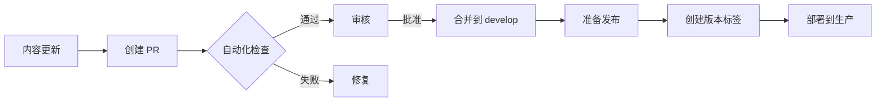

# 跨功能架构分析

## 文档系统架构

### 整体架构设计

SuperPower 文档系统采用 **分层模块化架构**，确保各功能模块松耦合、高内聚。

```
┌─────────────────────────────────────────────────┐
│                  用户界面层                      │
│         (Web / CLI / PDF / API)                 │
└────────────────┬────────────────────────────────┘
                 │
┌────────────────▼────────────────────────────────┐
│              内容编排层                          │
│    (路由 / 导航 / 主题 / �个性化)               │
└────────────────┬────────────────────────────────┘
                 │
┌────────────────▼────────────────────────────────┐
│              内容处理层                          │
│  (解析 / 验证 / 转换 / 索引)                     │
└────────────────┬────────────────────────────────┘
                 │
┌────────────────▼────────────────────────────────┐
│              存储层                              │
│    (Git / 文件系统 / 缓存 / 数据库)            │
└─────────────────────────────────────────────────┘
```

### 核心组件设计

#### 1. 内容管理系统（CMS）

**职责**：
- 文档生命周期管理
- 元数据索引与搜索
- 版本控制集成

**技术选型**：
- **基于 Git 的 Headless CMS**
- 原因：与代码库统一，降低维护复杂度
- 替代方案：Strapi、Contentful（评估中，因增加外部依赖暂不采用）

**约束**：
- MUST 支持离线内容编辑
- MUST 提供原子性提交保证
- SHOULD 支持分支预览

#### 2. 静态站点生成器（SSG）

**职责**：
- Markdown 到 HTML 转换
- 路由与页面生成
- 资源优化与打包

**技术选型**：
- **VitePress（首选）** 或 **Docusaurus（备选）**
- 评估标准：
  - 构建性能（Vite 优势）
  - 插件生态（Docusaurus 优势）
  - TypeScript 支持（均优秀）

**约束**：
- MUST 支持自定义组件
- MUST 生成 SEO 友好的 HTML
- SHOULD 支持服务端渲染（SSR）备选方案

#### 3. 搜索索引引擎

**职责**：
- 全文搜索索引构建
- 查询处理与结果排序
- 高亮与片段生成

**技术选型**：
- **Algolia DocSearch（生产环境）**
- **Lunr.js（离线备选）**
- **Pagefind（新兴方案，评估中）**

**约束**：
- 搜索响应时间 MUST < 200ms（p95）
- SHOULD 支持模糊匹配与同义词
- MUST 支持中文分词

#### 4. 内容验证框架

**职责**：
- 链接有效性检查
- 代码示例执行验证
- 元数据 schema 验证

**实现架构**：
```typescript
interface ValidationPipeline {
  validators: Validator[];      // 验证器链
  context: ValidationContext;    // 验证上下文
  report: ValidationReport;      // 验证报告
}

interface Validator {
  name: string;
  validate(content: Content): Promise<ValidationResult>;
  severity: 'error' | 'warning' | 'info';
}
```

**内置验证器**：
- `LinkValidator`：HTTP 链接检查
- `CodeExampleValidator`：代码执行验证
- `MetadataValidator`：Frontmatter schema 检查
- `SpellingValidator`：拼写检查（可选）

**约束**：
- 所有验证器 MUST 实现统一接口
- 验证失败 MUST 阻止发布（error 级别）
- SHOULD 支持自定义规则扩展

## 版本控制策略

### 分支模型

采用 **GitFlow 简化版本**，适配文档发布周期：

```
main (稳定版本)
  ↑
  │ merge
  │
develop (开发集成)
  ↑
  │ merge
  │
feature/quick-start-tutorial (功能分支)
feature/advanced-examples
hotfix/typo-correction
```

### 版本命名规范

**文档版本**：遵循 Semantic Versioning 2.0.0

- **MAJOR**：文档结构重大变更，破坏性 URL 变更
- **MINOR**：新增内容，向后兼容的功能增强
- **PATCH**：错误修正，内容改进

**示例**：
- `2.0.0`：迁移到新的文档结构（learn/how-to/reference）
- `2.1.0`：新增交互式示例章节
- `2.1.1`：修正快速入门指南中的代码错误

### 发布工作流



### 多版本管理

**策略**：主版本并行维护

- `main`：最新稳定版（v2.x）
- `release/v1`：旧版维护（v1.x，安全更新）
- `develop`：下一代开发（v3.x）

**版本切换机制**：
```typescript
interface VersionSwitcher {
  currentVersion: string;
  availableVersions: VersionInfo[];
  switch(version: string): void;
  compareVersions(v1: string, v2: string): number;
}
```

**约束**：
- 至少维护 2 个主版本（current + latest-1）
- MUST 提供版本迁移指南
- SHOULD 自动重定向旧链接到对应版本

## 构建与发布流程

### CI/CD 管道设计

```yaml
# 工作流阶段
stages:
  - validate      # 内容验证
  - build         # 静态站点构建
  - test          # 链接测试、可访问性检查
  - deploy        # 部署到生产环境
  - notify        # 发布通知
```

### 验证阶段（validate）

**检查项**：
1. **Markdown 格式**：markdownlint 规则
2. **链接有效性**：内部链接 + 外部 HTTP 链接
3. **代码示例**：语法检查 + 执行验证（TypeScript 编译）
4. **元数据完整性**：Frontmatter schema 验证

**失败处理**：
- Error 级别：阻止构建，报告具体位置
- Warning 级别：记录但允许继续，发布前必须解决

**示例配置**：
```json
{
  "markdownlint": {
    "MD013": { "line_length": 120 },
    "MD033": false,
    "MD041": false
  },
  "linkCheck": {
    "timeout": 5000,
    "retry": 3,
    "ignorePatterns": ["^http://localhost", "^https://internal.example.com"]
  }
}
```

### 构建阶段（build）

**优化策略**：
1. **增量构建**：仅重建变更文件
2. **代码分割**：路由级别懒加载
3. **资源压缩**：HTML/CSS/JS minification
4. **图片优化**：WebP 转换 + 响应式尺寸

**性能目标**：
- 完整构建：< 30 秒（1000 页文档）
- 增量构建：< 5 秒（10 页变更）
- 构建缓存命中率：> 80%

### 测试阶段（test）

**自动化测试**：
1. **可访问性**：axe-core 检查（WCAG 2.1 AA）
2. **SEO**：Lighthouse SEO 评分 > 90
3. **性能**：Lighthouse Performance 评分 > 90
4. **链接完整性**：无 404 链接

**人工验证**（发布前）：
1. 跨浏览器测试（Chrome、Firefox、Safari、Edge）
2. 移动设备响应式测试
3. 打印版 PDF 布局验证

### 部署阶段（deploy）

**部署策略**：
- **蓝绿部署**：零停机切换
- **CDN 缓存**：静态资源全球分发
- **原子性发布**：全部文件就绪后切换 DNS

**回滚机制**：
- 保留最近 5 个版本
- 一键回滚到上一稳定版本
- 回滚时间 < 2 分钟

**环境配置**：
```typescript
interface DeploymentConfig {
  environment: 'staging' | 'production';
  cdn: {
    provider: 'cloudflare' | 'aws-cloudfront';
    cacheTTL: number;          // 缓存时长（秒）
    purgeOnDeploy: boolean;    // 部署时清除缓存
  };
  monitoring: {
    errorTracking: string;     // Sentry DSN
    analytics: string;         // Google Analytics ID
  };
}
```

### 通知阶段（notify）

**发布通知**：
1. **Commit 自动生成**：基于变更日志
2. **多渠道发布**：
   - GitHub Release
   - 社区论坛公告
   - RSS 订阅更新
   - Email 订阅者（可选）

**变更日志格式**：
```markdown
## [2.1.0] - 2026-03-30

### Added
- 交互式代码示例章节（learn/interactive-examples）
- 中文翻译支持框架

### Changed
- 快速入门教程结构优化，减少 20% 阅读时间

### Fixed
- 修复 API 参考中的参数类型错误
- 修正搜索索引中缺失的页面

### Deprecated
- `examples/legacy` 章节将在 v3.0.0 中移除
```

## 跨平台兼容性

### 目标平台

**Web 浏览器**：
- 现代浏览器（Chrome 90+、Firefox 88+、Safari 14+、Edge 90+）
- 移动浏览器（iOS Safari 14+、Android Chrome 90+）

**CLI 工具**（未来）：
- Node.js 18+、20+
- Windows、macOS、Linux

**文档格式**：
- HTML（在线浏览）
- PDF（离线阅读、打印）
- Markdown（源文件）

### 响应式设计策略

**断点定义**：
```css
/* 移动设备 */
@media (max-width: 768px) { }

/* 平板设备 */
@media (min-width: 769px) and (max-width: 1024px) { }

/* 桌面设备 */
@media (min-width: 1025px) { }
```

**适配策略**：
- **移动优先**：基础样式针对小屏设计
- **渐进增强**：大屏幕增加侧边栏导航
- **触摸优化**：按钮最小尺寸 44×44px

### 打印样式支持

**场景**：用户生成 PDF 文档或打印

**实现**：
```css
@media print {
  /* 隐藏导航与交互元素 */
  .sidebar, .prev-next, .edit-link {
    display: none;
  }

  /* 优化分页 */
  h1, h2, h3 {
    page-break-after: avoid;
  }

  /* 代码块保持可读性 */
  pre {
    white-space: pre-wrap;
    border: 1px solid #ddd;
  }
}
```

**约束**：
- MUST 支持浏览器原生打印功能
- SHOULD 优化分页避免孤行/寡行
- MAY 提供专业 PDF 生成工具（如 Puppeteer）

### 离线访问支持

**Service Worker 策略**：
```javascript
// 缓存核心资源
const CACHE_NAME = 'superpower-docs-v1';
const CORE_ASSETS = [
  '/',
  '/index.html',
  '/assets/styles.css',
  '/scripts/main.js'
];

// 安装时预缓存
self.addEventListener('install', (event) => {
  event.waitUntil(
    caches.open(CACHE_NAME)
      .then(cache => cache.addAll(CORE_ASSETS))
  );
});

// 网络请求缓存策略
self.addEventListener('fetch', (event) => {
  event.respondWith(
    caches.match(event.request)
      .then(response => response || fetch(event.request))
  );
});
```

**约束**：
- 核心学习路径 MUST 可离线访问
- 缓存大小 SHOULD < 50MB
- MAY 提供离线模式切换开关

## 数据流架构

### 内容生成流程

```
作者编辑 (Markdown)
    ↓
Git 提交
    ↓
触发 CI/CD
    ↓
验证阶段 (lint + link check + code validation)
    ↓
构建阶段 (SSG 转换 + 资源优化)
    ↓
部署阶段 (CDN 分发)
    ↓
用户访问
```

### 用户交互数据流

```
用户请求
    ↓
CDN 边缘节点 (缓存命中)
    ↓
静态站点 (HTML + CSS + JS)
    ↓
浏览器渲染
    ↓
用户交互 (搜索、导航、反馈)
    ↓
分析平台 (Google Analytics / 自建)
```

### 搜索索引更新流程

```
内容变更
    ↓
触发索引重建
    ↓
提取文本内容
    ↓
分词与标记化
    ↓
构建倒排索引
    ↓
上传到搜索引擎 (Algolia / 更新本地索引)
    ↓
搜索结果可用 (延迟 < 10 秒)
```

## 可扩展性设计

### 插件系统（未来）

**设计目标**：支持社区扩展文档功能

**插件接口**：
```typescript
interface DocPlugin {
  name: string;
  version: string;
  // 内容转换钩子
  transform?(content: string): Promise<string>;
  // 页面生成钩子
  enhancePage?(page: Page): void;
  // 构建完成后钩子
  buildEnd?(context: BuildContext): Promise<void>;
}
```

**示例插件**：
- **图表生成器**：自动生成 Mermaid 图表
- **API 文档生成器**：从 TypeScript 类型定义生成文档
- **翻译助手**：集成机器翻译 API

### 国际化架构（i18n）

**目录结构**：
```
docs/
├── en/           # 英文（默认）
│   ├── learn/
│   └── how-to/
└── zh/           # 中文
    ├── learn/
    └── how-to/
```

**配置模型**：
```typescript
interface I18nConfig {
  defaultLocale: string;
  locales: LocaleConfig[];
  missingTranslation: 'error' | 'warning' | 'ignore';
  translationRatio: number;      // 翻译完成度阈值
}

interface LocaleConfig {
  code: string;                  // 语言代码
  name: string;                  // 显示名称
  lang: string;                  // HTML lang 属性
  maintainers: string[];         // 翻译维护者
  lastUpdate: ISO8601;           # 最后更新时间
}
```

**约束**：
- 默认语言 MUST 完整且最新
- 翻译内容 SHOULD 明确标记完成度
- MAY 支持语言自动切换（基于浏览器偏好）

## 安全性考虑

### 内容安全策略（CSP）

```http
Content-Security-Policy:
  default-src 'self';
  script-src 'self' 'unsafe-inline' https://cdn.jsdelivr.net;
  style-src 'self' 'unsafe-inline';
  img-src 'self' data: https:;
  font-src 'self' https://fonts.gstatic.com;
  connect-src 'self' https://*.algolia.net;
```

### 依赖安全

**策略**：
- 定期依赖更新（每月）
- 自动化漏洞扫描（npm audit）
- 许可证合规检查（仅允许 MIT/Apache-2.0/BSD-3-Clause）

**约束**：
- 高危漏洞 MUST 在 7 天内修复
- 中危漏洞 SHOULD 在 30 天内修复

### 用户生成内容（UGC）安全

**场景**：用户评论、社区贡献示例

**策略**：
- 内容净化（sanitize HTML）
- XSS 防护（转义用户输入）
- 垃圾内容过滤（验证码、人工审核）

**约束**：
- 所有 UGC MUST 通过净化管道
- SHOULD 实施 rate limiting 防止滥用

## 性能优化策略

### 加载性能优化

**核心指标**：
- FCP（First Contentful Paint）< 1.5s
- LCP（Largest Contentful Paint）< 2.5s
- TTI（Time to Interactive）< 3.5s

**优化技术**：
1. **关键 CSS 内联**：减少渲染阻塞
2. **字体预加载**：`<link rel="preload">` 自定义字体
3. **图片懒加载**：`loading="lazy"` 属性
4. **路由预加载**：鼠标悬停时预取链接

### 构建性能优化

**策略**：
- **并行处理**：多核 CPU 并行转换文档
- **缓存复用**：未变更文件使用缓存
- **按需构建**：预览模式仅构建当前页面

**监控指标**：
- 构建时间趋势
- 缓存命中率
- 内存使用峰值

### 搜索性能优化

**策略**：
- **索引分片**：按主题分片减少查询范围
- **查询缓存**：热门查询结果缓存
- **结果分页**：限制返回结果数量

**目标**：
- p50 响应时间 < 100ms
- p95 响应时间 < 200ms
- p99 响应时间 < 500ms

## 监控与告警

### 关键指标监控

**技术指标**：
- 构建成功率（目标：> 99%）
- 链接有效性（目标：> 98%）
- 页面加载性能（目标：Lighthouse > 90）
- 错误率（目标：< 0.1%）

**业务指标**：
- 日活用户数（DAU）
- 平均会话时长
- 跳出率（目标：< 40%）
- 搜索使用率

### 告警策略

**告警级别**：
- **P0（紧急）**：站点完全不可用，立即告警
- **P1（高）**：核心功能受损（搜索、导航），1 小时内响应
- **P2（中）**：性能下降、链接失效，24 小时内响应
- **P3（低）**：内容错误、拼写问题，下次发布修复

**通知渠道**：
- P0/P1：即时消息（Slack/钉钉）+ Email
- P2：每日汇总邮件
- P3：每周报告

---

**文档版本**：1.0.0
**最后更新**：2026-03-30
**架构师**：System Architect
**状态**：Final Draft
